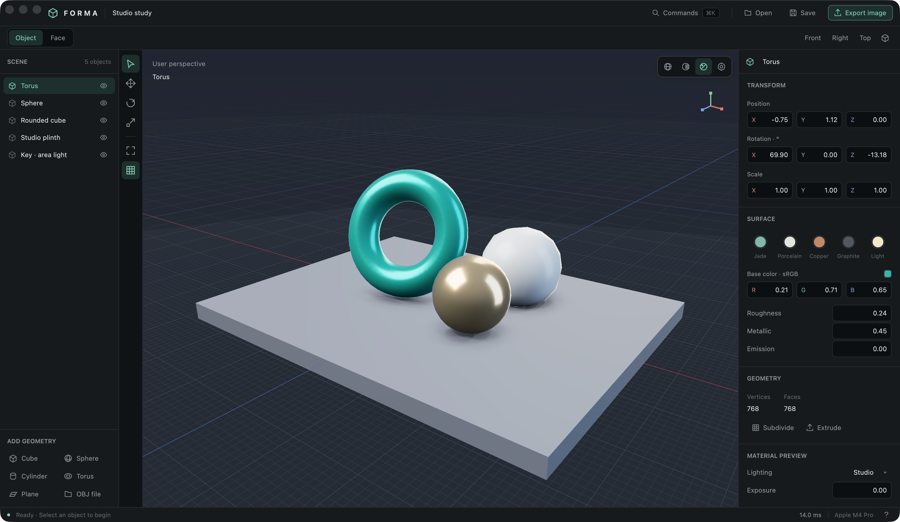
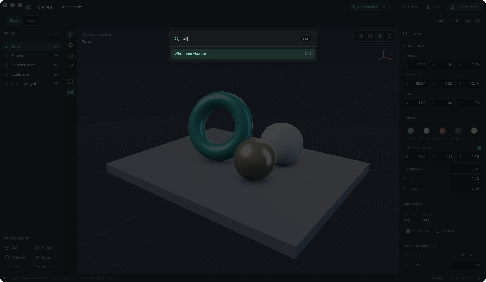
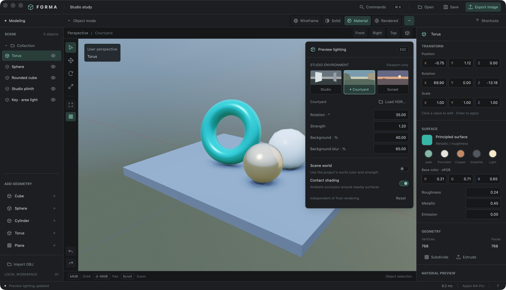

# Forma

A native Rust geometry editor built with GPUI and Metal. Forma combines a compact,
keyboard-driven workspace with direct mesh editing and a progressive path-traced
viewport. The initial scope is modelling and rendering on macOS.

The application opens into a small studio scene: a teal torus, metallic sphere,
rounded cube, plinth and emissive area light.



## Download website

The standalone [download site](site/README.md) lives in `site/`. It can be served
by any static host without a build step and automatically discovers the latest
public GitHub release and available Mac downloads. The included
[GitHub Pages workflow](.github/workflows/pages.yml) deploys it from `main` after
selecting **GitHub Actions** as the source in the repository's Pages settings.

```sh
python3 -m http.server 4173 --directory site
```

## Run

Use a Mac with a Metal GPU, Rust and the Apple Command Line Tools. Development
has been verified with Rust 1.92.0 on macOS 26.6.2 / Apple M4 Pro; an older macOS
compatibility floor has not been established.

```sh
# Install the Command Line Tools if they are missing.
xcode-select --install

# From this repository:
cargo run --locked -p forma
```

The GPUI dependency enables `runtime_shaders`. GPUI and Forma compile Metal
source at runtime, so the verified development setup uses the Command Line Tools
without a full Xcode installation or the separate offline Metal compiler.
The first build downloads and compiles GPUI's dependencies.

For an optimized executable:

```sh
cargo run --locked --release -p forma
```

## Current workflow

- Add cubes, spheres, cylinders, tori and planes; select objects in the viewport
  or outliner, duplicate, hide and delete them.
- Move, rotate and scale objects or selected faces with axis constraints,
  numerical input and viewport handles. Edit exact values in the inspector.
- Extrude a selected face by 0.30 units, then transform it. Apply Catmull–Clark
  subdivision to the selected mesh.
- Choose material presets and adjust roughness, metallic response, emission,
  world strength and exposure. Enter arbitrary sRGB base colors and rename objects.
  Set the progressive sample and bounce limits.
- Save `.forma` projects with a versioned object graph, reusable mesh/material
  data, transforms, camera, world and render preferences. Version-1 projects
  migrate on open. Save replacement is atomic; edits support undo/redo.
- Import OBJ polygon geometry, export transformed scene geometry to OBJ, and
  export the current render mode to PNG while continuing to edit.
- Search commands with `⌘K`, type a name, then use arrows and Return to execute.
  Native macOS File/Edit/View menus expose the same editor operations.

OBJ import combines groups into one object. Texture coordinates, supplied normals
and MTL materials are not retained; normals are generated from the editable
geometry. PNG export uses the current viewport dimensions and sample target,
with editor selection/grid overlays disabled.

## Render modes

Press **Z** to open the shading pie at the cursor. Hold Z, move toward a mode,
and release to switch; tap Z to keep the menu open, then click or press its number.
Rendered sits above, Material Preview below, Wireframe left, and Solid right.
Arrow keys highlight a mode and Return selects it. Escape or right click cancels.

| Key | Mode | What it displays |
| --- | --- | --- |
| `Z`, then `4` | Wireframe | Blender-style X-ray original polygon edges (bright front, dimmed occluded); no triangulation diagonals. |
| `Z`, then `6` or directly `X` | Solid | Neutral clay shading with studio lighting. |
| `Z`, then `2` or directly `C` | Material Preview | Immediate metallic/roughness shading with HDR environment reflections and contact shading. |
| `Z`, then `8` or directly `V` | Rendered | Progressive lighting from the scene world and emissive meshes, without film grid or selection outlines. |

The menu stays inside the viewport near its edges. Opening, hovering, cancelling,
or choosing the current mode preserves progressive accumulation. During a
transform, Z continues to constrain the world Z axis.



Material Preview displays a complete, deterministic frame without accumulating
path-tracing noise. The modelling modes use the display's backing pixel density
for sharp Retina rendering, within a proportional 2560 × 1600 resolution cap.
Camera updates and completed frames use event-driven delivery. Material Preview
uses Metal ray-tracing acceleration where supported, keeping full preview quality
during navigation.
Its lighting dropdown provides Studio, Courtyard and Sunset
environments, custom Radiance `.hdr` loading, rotation, intensity, background
visibility and blur. **Scene world** uses the project's world color and strength.
Otherwise preview lighting is independent of the scene world. Visible emission
remains part of the material; scene emitters do not light other objects in preview.
These preview controls are session settings and do not change the document or undo history.



Rendered mode traces full light paths. The renderer implements opaque Lambert
diffuse and GGX reflection, direct emitter/environment sampling, multiple
importance sampling, Russian roulette, linear accumulation, exposure and an
ACES-style display curve. Display stays on the GPU through IOSurface-backed
CoreVideo NV12 buffers consumed by GPUI; CPU pixel readback occurs for explicit
PNG export and numerical tests.

This is an initial opaque-surface renderer, with no claim of Blender or Cycles
feature parity. Transmission/refraction, volumes, subsurface scattering, material
textures, denoising and adaptive sampling are not implemented. HDR environment
imports currently support Radiance `.hdr` files for Material Preview. Animation,
sculpting, modifiers beyond destructive subdivision, UV editing and a full
vertex/edge modelling toolkit are outside the current application. See the
[renderer notes](crates/forma-render/README.md) for transport details and limits.

## Controls

The viewport must have keyboard focus. The in-app command panel opens with
`⌘K`, `Space` or `Shift+A`; `H` opens the shortcut reference.

| Action | Input |
| --- | --- |
| Select object / face | Left click; `Tab` toggles object and face modes |
| Orbit | Two-finger trackpad drag, middle/right drag, `Option` + left drag, or `Option` + wheel |
| Pan | `Shift` + two-finger drag, `Shift` + middle/right drag, or `Shift` + wheel |
| Zoom / frame selection | Pinch, mouse wheel, or `Ctrl` / `⌘` + two-finger drag / `F` |
| Shading pie | `Z`; hold and flick, or tap then select |
| Move / rotate / scale | `G` / `R` / `S` |
| Constrain transform | `X`, `Y` or `Z` during a transform |
| Enter an exact transform | Type a value; angles are degrees, scale is a factor |
| Apply / cancel transform | Click or `Return` / `Esc` or right click |
| Fine pointer movement | Hold `Shift` during a transform |
| Extrude face | `E` in face mode with a selected face |
| Duplicate / delete | `⌘D` or `Shift+D` / `Delete` or `Backspace` |
| Front / right / top | `1` / `3` / `7` |
| Toggle projection / reset perspective | `5` / `0` |
| Undo / redo | `⌘Z` / `⌘Shift+Z` |
| New / open / save / save as | `⌘N` / `⌘O` / `⌘S` / `⌘Shift+S` |

An unconstrained numeric move uses world X. Rotation without an axis constraint
uses the viewing axis. Subdivision, imports, exports, primitives and material
presets are also available through the visible panels and command panel.

## Verify

```sh
cargo fmt --all -- --check
cargo test --locked --workspace
cargo clippy --locked --workspace --all-targets -- -D warnings
cargo run --locked -p forma -- --smoke-test artifacts/native-smoke

# Render all four modes through real Metal kernels, without opening a window.
cargo run --locked -p forma-render --bin render-smoke -- artifacts/render 128
```

The native smoke test opens its own GPUI window without taking keyboard focus.
It exercises keyboard dispatch, continuous pointer-handler input, real Metal
frames, modelling commands, background document operations, and concurrent PNG
export. It also captures only its own window for visual checks. Native file-picker
interaction and OS pointer routing remain manual checks.

Core geometry tests can run independently with `cargo test --locked -p forma-core`.
Renderer tests and the native application require macOS and a Metal GPU. The
[validation record](docs/VALIDATION.md) separates executed numerical, image and
application checks from unverified scale or performance claims.

## Bundle

```sh
./scripts/bundle-macos.sh release
open target/release/Forma.app

# Faster iteration using the development profile:
./scripts/bundle-macos.sh debug
```

The script builds the selected profile and creates a local `Forma.app` inside
`target/<profile>/`. It packages the current host architecture and does not sign
for distribution, notarize or install the application. Release builds use thin
LTO and may take longer than development builds.

See [architecture](docs/ARCHITECTURE.md) for crate boundaries, frame ownership,
render invalidation and document transactions.
