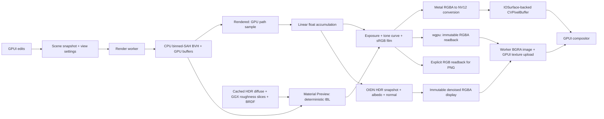

# Architecture

Forma has three crates. Scene data is independent of UI and GPU resources; the
native app owns interaction and coordinates the renderer through a worker.

| Crate | Responsibility |
| --- | --- |
| `forma-core` | Indexed polygon meshes, primitives, subdivision/extrusion, materials, transforms, camera, picking, history and scene/OBJ I/O. |
| `forma-render` | Native Metal and wgpu compute pipelines, shared triangle/BVH upload and light transport, progressive film, immutable display frames and PNG readback. |
| `forma` (`crates/forma-app`) | GPUI workspace, commands, inspector, outliner, face/object transforms, native dialogs, viewport overlays and render scheduling. |

## Scene and geometry

Coordinates are right handed with +Y up. Editable meshes retain polygon faces;
ear clipping produces triangles for rendering and picking. Original polygon
edges remain distinguishable from triangulation diagonals. Primitive winding is
outward. Subdivision uses Catmull–Clark interior and open-boundary rules; extrusion
replaces its source cap and connects the boundary with side faces.

The scene model separates **objects** from reusable **data blocks**. An object
owns identity, name, local transform, parent, visibility, selectability,
collection links and a typed payload. Mesh payloads reference named mesh and
material data by stable IDs, so multiple objects can instance the same data.
Normal duplication makes independent mesh/material copies; linked duplication
shares them, and either link can later be made single-user. Mesh instances are
the resolved boundary used by render, picking, OBJ and editor code, keeping
those consumers independent of storage layout and non-mesh object types.

Object payloads currently model mesh, empty, light and camera objects, plus a
namespaced custom type with JSON properties for forward-compatible extensions.
Collections form a visibility hierarchy, objects may belong to multiple
collections, and object parent chains compose local transforms into world
transforms. A parent-inverse matrix preserves an object's exact world transform
when it is parented under rotated, nonuniformly scaled geometry. Parent and
collection cycles, dangling references and global ID collisions are rejected by
validation. Data blocks may intentionally outlive their users and can be removed
explicitly with orphan purging, matching the useful parts of Blender's
object/data distinction.

Transforms are translation, XYZ Euler rotation in radians and scale. The
viewport camera supports perspective and orthographic projection with the shared
0–1 depth range. Its analytic yaw/pitch basis remains defined at exact
top/bottom views. Picking transforms rays into each object's local coordinates
while preserving world-space hit distances under hierarchy and nonuniform
scaling.

Materials contain linear RGB base color and emission, metallic weight and
roughness. The renderer computes smooth corner normals with a 45-degree crease
threshold and transforms them correctly under nonuniform scale. The current
surface model is opaque; there is no texture or transmission graph.

## Interaction and scheduling

`Studio` owns the mutable `Scene`, current selection, command/field state and
document history. A drag starts from an immutable original object and applies
pointer or typed deltas against that original, avoiding incremental numerical
drift. Commit validates the edited scene and creates one undo checkpoint;
cancellation restores the original object.

GPUI submits pending changes at the end of the current input/effect cycle.
Geometry edits refresh a shared `Arc<Scene>` snapshot; camera/world updates reuse
the geometry snapshot. The render worker has one pending request slot: new input
replaces obsolete pending work instead of building an unbounded queue. Completed
frames wake GPUI through a bounded async notification channel. Layout and display
scale changes trigger resizing directly. There is no periodic polling delay or
idle render timer. The event loop does not wait for GPU completion and can present
the most recently completed surface while a newer request is rendering.

A separate denoising worker owns a persistent OIDN device and a bounded latest-snapshot
mailbox. Generation guards reject stale clean frames; completion wakes GPUI even
when the path tracer has reached its sample cap. Denoised display uses immutable
RGBA images on all platforms.

The worker owns its `Renderer` and renders one sample per call. Static modes stop
after one frame, including Material Preview; Rendered continues to the sample cap and
then sleep until another request arrives. PNG export uses a separate renderer
and immutable scene snapshot, so export does not replace the interactive film.
Export still shares the physical GPU and can reduce viewport throughput.

## GPU pipeline and surface ownership

A public `Renderer` selects native Metal on macOS by default, or wgpu using
Metal, DirectX 12 or Vulkan. The application passes its selected backend to both
the viewport worker and independent export workers. `RenderSettings`, geometry
fingerprints, uniforms, BVH construction, bounded HDR decoding and built-in HDR
rigs are shared across implementations. WGSL ports preserve the Metal shader
algorithms; shader tests validate layouts and translate all kernels to native
SPIR-V, MSL and HLSL.

GPU geometry buffers and accumulation persist across samples. A scene revision
causes validation and a geometry fingerprint check; unchanged geometry avoids
BVH rebuild and upload. Native Metal Material Preview uses a cached primitive acceleration
structure on devices supporting Metal ray tracing, and software BVH traversal on
other devices and all wgpu backends. Its primary, antialiasing, nearest-hit contact AO and selection
rays keep the same sampling and lighting calculations. The structure references
the world-space triangle buffer with explicit vertex indices, preserving material
and object IDs; it is built lazily and reused throughout camera navigation.
Rendered retains its existing software traversal and estimator. Film identity includes camera, dimensions, world and
render settings. A lighting or view change resets accumulation. Raising the
sample target resumes the existing film. Selection/grid state affects only the
modes which display those overlays. A frame at its sample cap is reused. Material
Preview has a separate cache identity that ignores path-tracing targets and
unused scene-world settings. Preview-only lighting never resets Rendered.

Preview uses cached HDR textures for diffuse irradiance and filtered specular
reflections, with a split-sum BRDF lookup and bounded contact AO. Environment
baking happens on the render worker only when a new light is selected. Custom
HDR files are validated on a background executor before applying them; request
identity guards reject stale completions after selecting another environment.

For native Metal, GPUI 0.2.2's macOS surface compositor requires bi-planar NV12. Forma therefore
converts its RGB film to full-range BT.601 NV12 on the GPU and obtains output
planes from a CoreVideo pixel-buffer pool. Normal display performs no CPU pixel
copy. PNG export reads the RGB film, avoiding display chroma subsampling.

wgpu copies each completed display film into an aligned reusable staging buffer
and publishes tightly packed immutable RGBA pixels. The worker prepares BGRA
pixels for GPUI's image API, and the UI removes previous image allocations from
its texture atlas when adopting a newer frame. There is a readback and upload per
frame; rendering and conversion remain off the UI event loop. A retained portable
frame owns its pixels even after resize or renderer destruction.

A published native `Frame` retains an immutable pixel buffer. The renderer completes
GPU writes before publishing it and never overwrites a retained surface. Metal
texture wrappers stay alive until their command completes. CoreVideo can recycle
storage only after all consumers release it. These rules justify sending a
completed frame between the worker and GPUI threads.

Detailed BSDF, estimator, BVH and display behavior lives in the
[renderer documentation](../crates/forma-render/README.md).

## Documents and undo

The `.forma` format is versioned JSON with `format`, `version` and `scene` fields.
Version 2 stores the object graph, reusable mesh/material data blocks,
collections, typed object payloads, camera, world and render preferences.
Version-1 files are migrated on load into independent mesh/material data blocks;
older files without render preferences receive defaults. Selection, active
tool, viewport shading mode and preview environment controls are session state.

Load checks finite values, camera/material ranges, unique IDs, polygon indices,
triangulability and aggregate geometry limits before replacing the current scene.
Save validates first, writes and syncs a temporary file beside the destination,
then renames it atomically. A failed write leaves the previous document intact.
The app asks before discarding a dirty document on new/open/close.

History stores up to 64 whole-scene checkpoints and trims older snapshots using
an estimated 256 MiB geometry budget. Shared mesh data is counted once per scene
rather than once per object instance. At least one transaction is retained even
if its single scene exceeds that budget. A new edit clears the redo branch. This
is a straightforward initial transaction model; large-scene editing would
benefit from operation-level history and copy-on-write data blocks.

OBJ is a geometry interchange path, not a project format. Import handles polygon
faces, positive/negative indices, common `v/vt/vn` syntax and line continuations;
groups become one editable object. Supplied UVs, normals and MTL data are not
retained. Export bakes object transforms and reverses winding for reflections.

## Current performance boundaries

Wireframe, Solid and Material Preview render at the window's backing pixel density,
including 2× Retina displays. Oversized viewports scale uniformly into a
2560 × 1600 budget before even-dimension NV12 alignment, keeping their aspect
ratio within rounding precision. Moving between displays updates the backing scale.
Rendered retains one render pixel per logical point for its path-tracing budget.
The public renderer permits up to 8192 × 8192; the UI currently exports at the
active mode's viewport resolution. Core document limits protect
resource use but are not tested interactive-performance guarantees.

Wireframe, Solid and Rendered use software BVH traversal; Material Preview can
use native Metal ray-tracing acceleration structures. wgpu modes use the shared
software BVH on the GPU. Geometry validation, triangulation, BVH construction,
OBJ I/O and history cloning remain CPU work. Project/OBJ parsing and disk writes
run on background executors. Snapshot cloning, picking, subdivision and transform
validation still run on the UI thread and can pause on large meshes. Generation
and document-identity guards reject stale loads and preserve edits made during
an asynchronous save. Material Preview produces deterministic IBL shading in one
frame; its reflections use the environment and contact shading approximates
occlusion. Rendered has optional Open Image Denoise reconstruction for the viewport
and exports; its original Monte Carlo film continues accumulating independently.
Adaptive sampling is not implemented. See [AI denoising](DENOISING.md) for the
three-pass HDR pipeline, asynchronous scheduling and runtime distribution.

The [validation record](VALIDATION.md) documents the tests and local measurements
actually executed. Future performance work can replace GPU traversal or history
storage behind these crate boundaries without changing scene serialization.
